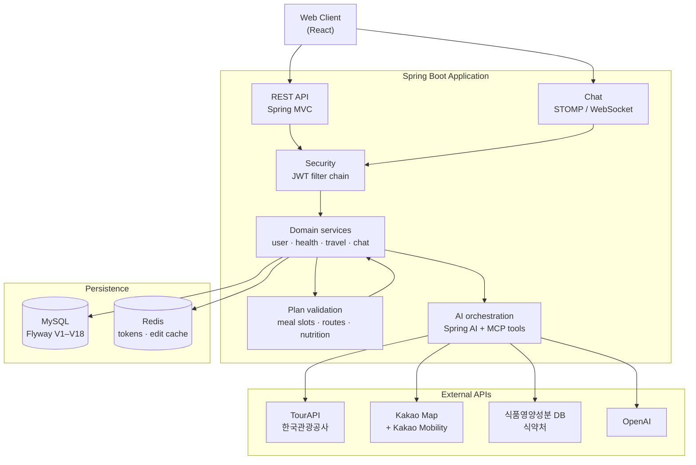
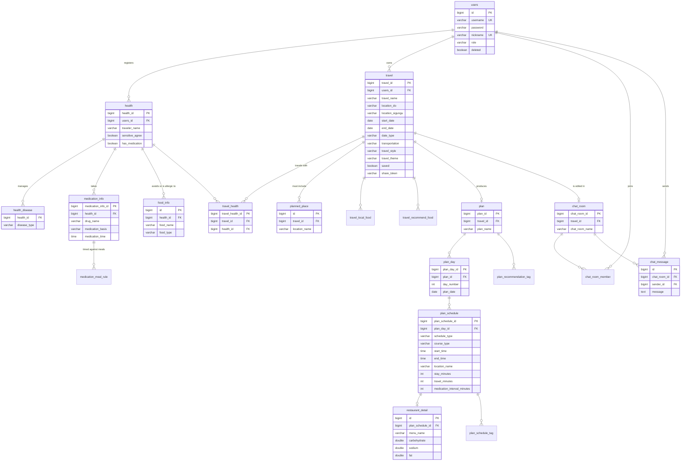

🚀 Project Name : Yeoro
---

# 📌 About

* *Why was this project created?*
    * Travelers with chronic conditions often need to consider medication schedules, meal timing, dietary restrictions, and physical activity in addition to sightseeing. Existing travel services primarily focus on recommending destinations, without taking individual health conditions into account.<br><br>
* *What problem does it solve?*
    * The project generates personalized travel itineraries by combining public tourism data with users' health conditions and travel preferences. It helps users enjoy their trips more safely by considering medication schedules, meal timing, dietary preferences, walking distance, and other health-related constraints throughout the itinerary.<br><br>
* *Who is it for?*
    * This service is designed for travelers managing chronic conditions, such as diabetes, hypertension, or dyslipidemia, as well as anyone seeking a safer and more personalized travel planning experience.<br><br>
* *What are the main goals?*
    * To provide reliable AI-generated travel itineraries that balance tourism, dining, and health management by leveraging public tourism datasets, nutritional information, and AI-based itinerary planning with rule-based validation.

---

# 🏗️ System Architecture

The backend is a single Spring Boot application. It serves REST endpoints over
Spring MVC, streams chat over STOMP/WebSocket, and calls external APIs
reactively through WebFlux's `WebClient`. Itinerary generation runs through
Spring AI: the model is given a set of MCP tools and may only use facts those
tools return, and every itinerary the model produces is then checked and
repaired by rule-based Java validation before it reaches the user.



### Components

| Component | Role |
|-----------|------|
| **Backend** | Spring Boot application — REST API, STOMP chat, AI orchestration, plan validation |
| **AI** | Spring AI with an OpenAI chat model; the model reaches external facts only through MCP tools exposed by the backend |
| **Database** | MySQL as the system of record, schema versioned by Flyway |
| **Cache** | Redis for refresh tokens, authentication lookups, and pending plan edits |
| **External APIs** | TourAPI (attractions, restaurants), Kakao Map + Kakao Mobility (places, routes), 식약처 식품영양성분 DB (nutrition) |
| **Frontend** | React web client (separate repository) |

### MCP Tools

The model cannot invent places, routes, or nutrition values. It must obtain
them from these tools, which the backend exposes as an MCP server:

| Tool | Purpose |
|------|---------|
| `searchAttractionsByRegion` | Attraction candidates for a 시/도 + 시군구 |
| `searchRestaurantsByLocation` | Restaurant candidates by keyword and region |
| `getRestaurantDetail` | Menu, hours, address, and coordinates for one restaurant |
| `findPlaceWithRoute` | Resolve a place and the travel time to it in one call |
| `getRoute` | Travel time between two places for a given transportation mode |
| `evaluateFoodNutrition` | Grade a menu against a traveler's conditions using the MFDS nutrition database |

A second tool set with the same shape backs the chat-based edit flow, so an
edit is held to the same factual constraints as the original generation.

### Database Schema



Schema changes go through Flyway only (`V1` … `V18`).

---

# ✨ Key Features

## 🔐 Authentication

- JWT-based authentication
- Access Token & Refresh Token, with refresh token rotation
- Redis-backed refresh token and authentication cache
- Spring Security filter chain: everything is authenticated except sign-up,
  login, duplication checks, account recovery, API docs, and shared-itinerary
  links
- STOMP handshake authenticated through the same token

## 🧳 Core Features

- Traveler and companion health profiles: managed conditions, medication
  schedule, meal times, allergies, and disliked foods
- Travel setup: region, dates, transportation, style, theme, and places the
  traveler insists on visiting
- AI itinerary generation, then rule-based repair and validation
- Save an itinerary, list saved itineraries, and issue a share link that
  anyone can open without an account

## 🤖 AI Features

- Itinerary generation grounded in TourAPI, Kakao, and MFDS data through MCP
  tools
- Natural-language itinerary editing over chat, with a preview → confirm →
  cancel flow so nothing changes until the traveler agrees
- Rule-based validation after generation: missing meals are filled from real
  restaurant candidates, duplicate menus are rejected, travel times are
  recomputed when the order of places changes, and unreachable places are
  dropped
- Nutrition grading per condition: carbohydrate, sodium, and fat are looked up
  in the MFDS database and converted to a per-serving basis before being
  compared against thresholds
- Medication slots placed relative to the traveler's actual meal times

---

# 🔁 What Changed Since v1

**v1** is the first build that deployed cleanly. Everything below landed after
that point.

| Area | Change |
|------|--------|
| **Chat-based editing** | An itinerary can be changed by describing the change in plain Korean. The edit is rendered as a preview first and only written after confirmation. |
| **Multiple conditions per traveler** | A traveler used to carry one condition. They now carry a set, and the itinerary is graded against all of them. |
| **Nutrition accuracy** | Nutrition was blank or zero for most menus. Values are now converted to a per-serving basis rather than being read per 100 g, restaurant menu names are resolved to standard food item names before lookup, and unrelated matches are no longer accepted through suffix normalization. |
| **Meal slot integrity** | Meals registered by the traveler can no longer be dropped when a day's attractions are trimmed, the slot filler no longer repeats a menu already used in the trip, and meals added during completion are now graded for nutrition like any other. |
| **Route consistency** | Travel times are recomputed after a meal is inserted, so a reordered day no longer carries stale durations. |
| **Sharing and saving** | An itinerary is explicitly saved, and only saved itineraries appear in the list. A share token opens an itinerary without authentication. |
| **Failure feedback** | A chat message that fails now tells the client why over STOMP instead of leaving it silent. |
| **Test separation** | Tests that call live external APIs are tagged `external` and excluded from the default task, so `./gradlew test` runs without any API key. |

Design notes and the reasoning behind these changes live in `docs/ai/`.

---

# 🛠️ Tech Stack

<div align="center">

##### Language


##### Framework


##### Persistence


##### Testing


##### Frontend


</div>

| Layer | Choice |
|-------|--------|
| Web | Spring MVC for the REST API, WebFlux `WebClient` for outbound external calls |
| Realtime | Spring WebSocket with STOMP |
| Security | Spring Security, `jjwt` 0.12.3 |
| Persistence | Spring Data JPA, QueryDSL 5.0.0 (jakarta), Flyway |
| AI | Spring AI 2.0.0 — OpenAI chat model, MCP server and client |
| Docs | SpringDoc OpenAPI 3.0.3 |

---

# 📁 Project Structure

```text
BE/
├── .github/
│   └── ISSUE_TEMPLATE/          # Issue and pull request templates
│
├── docs/
│   ├── ai/                      # AI behaviour notes and research
│   └── convention/              # Team and backend conventions
│
├── src/
│   ├── main/
│   │   ├── java/
│   │   │   └── com/planb/
│   │   │       ├── ai/          # Prompts, MCP tools, AI handlers, contexts
│   │   │       ├── domain/      # user · health · travel · chat
│   │   │       ├── query/       # QueryDSL read layer
│   │   │       ├── global/      # Security, clients, config, websocket, docs
│   │   │       └── planBApplication.java
│   │   │
│   │   ├── generated/           # QueryDSL Q classes (git-ignored)
│   │   └── resources/
│   │       ├── db/migration/    # Flyway V1–V18
│   │       ├── application.yml
│   │       └── application-common-{local,dev,prod,test}.yml
│   │
│   └── test/java/com/planb/
│       ├── unit/                # Pure logic, mocked collaborators
│       ├── slice/               # Repository and persistence slices
│       ├── controller/          # REST endpoint behaviour
│       └── integration/         # Full flow, real containers
│
├── gradle/
├── build.gradle
├── settings.gradle
└── README.md
```

> The Java package and Gradle module are still named `planb` / `plan_b` from
> the project's working title. Only the product name changed.

---

# 🚀 Getting Started

## Prerequisites

- Java 21
- Git

---

## 1. Clone Repository

```bash
git clone https://github.com/team-planb-dev/BE.git
cd BE
```

---

## 2. Configure Environment

Every setting is injected through environment variables — no credentials are
committed. Export the following before running:

| Variable | Used for |
|----------|----------|
| `DATABASE_URL`, `DATABASE_USERNAME`, `DATABASE_PASSWORD` | MySQL connection |
| `REDIS_URL` | Redis connection |
| `JWT_SECRET` | Access and refresh token signing |
| `OPENAI_API_KEY`, `OPENAI_MODEL` | Spring AI chat model |
| `OPENAI_REASONING_EFFORT` | Optional, defaults to `none` |
| `KOR2_SERVICE_URL`, `KOR2_SERVICE_KEY` | TourAPI |
| `KAKAO_MAP_API_BASE_URL`, `KAKAO_MOBILITY_API_BASE_URL`, `KAKAO_REST_API_KEY` | Kakao Map and Mobility |
| `FOOD_NTR_CPNT_URL`, `FOOD_NTR_CPNT_KEY` | 식약처 식품영양성분 DB |

The active profile is `local` unless `SPRING_PROFILES_ACTIVE` says otherwise.
Available profiles: `local`, `dev`, `prod`, `test`.

Point `DATABASE_URL` at an empty database. Flyway runs every migration on
startup, so no schema setup is needed beforehand.

---

## 3. Build the Project

```bash
./gradlew clean build
```

---

## 4. Run the Application

```bash
./gradlew bootRun
```

Or run the generated JAR:

```bash
java -jar build/libs/plan_b-0.0.1-SNAPSHOT.jar
```

---

## 5. Verify the Application

- Swagger UI — `http://localhost:8080/swagger-ui.html`

---

# 📖 API Documentation

Generated with **SpringDoc OpenAPI**.

- Swagger UI — `http://localhost:8080/swagger-ui.html`
- OpenAPI specification — `http://localhost:8080/v3/api-docs`

All REST endpoints live under `/api/v1`:

| Prefix | Area |
|--------|------|
| `/api/v1/user` | Sign-up, my page, withdrawal, duplication checks, account recovery |
| `/api/v1/health` | Traveler and companion health profiles |
| `/api/v1/travel` | Local food recommendations, place search, itinerary generation, listing, saving, sharing, and the edit preview/confirm/cancel flow |
| `/api/v1/chat/room`, `/api/v1/chat/member` | Chat rooms and membership |
| `/api/v1/chat/{roomId}/send` | STOMP destination for chat messages |

---

# 🧪 Testing

Tests are split by layer so each one can fail for a single reason.

| Layer | What it covers | Tools |
|-------|----------------|-------|
| Unit | Business logic in isolation | JUnit 5, Mockito, Reactor Test |
| Slice | Repositories and persistence | JUnit 5, Testcontainers |
| Controller | REST endpoint contracts | JUnit 5, Mockito, MockMvc |
| Integration | End-to-end flow against real infrastructure | JUnit 5, Testcontainers |

### Test Environment

Slice and integration tests provision their own infrastructure through
Testcontainers. No external API key is needed for the default task.

### Run tests

```bash
./gradlew test
```

This runs every test **except** those tagged `external`.

### Run tests that call live external APIs

```bash
./gradlew externalTest
```

These call OpenAI, TourAPI, Kakao, and the MFDS nutrition API for real. They
need the corresponding keys exported, they cost money, and they are slow —
which is why they are excluded from the default task.

---

# 📊 Monitoring

Not yet enabled. The Actuator and Micrometer dependencies are present in
`build.gradle` but commented out, so no metrics endpoint is exposed today.

### Metrics *(Planned)*

- CPU and memory usage
- JVM metrics
- HTTP request metrics
- Database connection pool
- AI API response time

### Dashboard *(Planned)*

- Prometheus
- Grafana

### Logging

Application logging is configured in `application.yml`: Spring AI and the
external API clients log at `DEBUG` so every outbound call and model exchange
is traceable. Centralized log collection is not set up yet.

---

# 🚢 Deployment

Every credential and endpoint is supplied as an environment variable, so the
same build runs unchanged across profiles. Schema changes are applied by
Flyway on startup, and `ddl-auto` is `validate` so a schema that drifts from
the entities fails fast instead of being silently rewritten.

## CI/CD *(Planned)*

No GitHub Actions workflow is committed yet. Build and test currently run
locally before a pull request is merged.

---

# 👥 Team

| Role | Name | GitHub |
|------|------|--------|
|PM|이승협|.|
|Designer|조예원|.|
| Backend | 강우주 | <a href="https://github.com/wooju-kang"></a> |
| Frontend | 임성은 | <a href="https://github.com/sungeunlim03"></a> |

---
