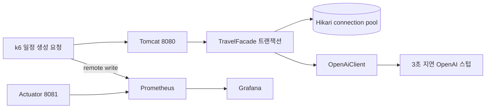

# Phase 4A-2 Travel AI 자원 포화 실험

## 1. 목적

고정된 OpenAI 지연을 추가한 일정 생성 부하에서 Hikari connection pool과 Tomcat 요청 스레드 중 어느 자원이 먼저 포화되는지 판정한다. 결과가 나오기 전에 임계값을 고정하며, 이 실험에서 운영 코드 최적화는 하지 않는다.

## 2. 사전 고정값

| 항목 | 값 |
|---|---|
| OpenAI 호출 1회 고정 지연 | 3초 |
| 일정 1건의 OpenAI 왕복 | 2회 |
| Hikari 기본 최대 커넥션 | 10 |
| 조건부 pool 처리량 근사치 | `10 / (2 × 3초) ≈ 1.7 req/s` |
| 저율 실행 | 1 req/s, 60초 |
| DB pool 탐색 | 3 req/s, 60초 |
| 조건부 Tomcat 탐색 | 30 req/s, 30초 |
| VU | 실행별 예상 동시성을 사전 할당 |
| 장기 요청 SLO 경계 | 3초, 6초, 8초, 10초 포함 |
| Hikari 대조 실행 | 첫 판정에서는 수행하지 않음 |

`1.7 req/s`는 커넥션 10개가 OpenAI 왕복 6초 동안 계속 점유된다는
조건이 맞을 때만 유효한 근사치다. 실제 pool 크기, 성공 응답당 OpenAI 호출 수와
Hikari usage·pending으로 검증한다.

## 3. 실행 구조



애플리케이션 요청과 management scrape의 Tomcat connector는 분리해서 보고,
Grafana에는 k6 부하 지표와 동일 시간 범위의 애플리케이션 지표를 함께 표시한다.

## 4. 중단 조건

다음 중 하나가 15초 이상 지속되면 실행자가 부하를 중단하고 해당
시점까지의 지표를 보존한다. 현재 스크립트는 이 조건을 자동 감시하지 않는다.

- process CPU 90% 이상
- `일정 생성 HTTP 실패율` 패널의 k6 HTTP failure가 20% 이상으로
  5초 refresh 3회 연속 유지되거나 server 5xx / 15s가 20% 이상
- Hikari pending이 0보다 큰 상태에서 응답 지연이 계속 증가
- 애플리케이션, MySQL 또는 Redis 컨테이너의 비정상 종료

## 5. 판정 기준

### DB pool 선행 포화

- `hikaricp_connections_active` 10 근접
- `hikaricp_connections_pending > 0` 10초 이상 지속
- `hikaricp_connections_usage_seconds` 증가
- 동일 구간의 8080 connector Tomcat `busy / max < 0.8`

이 조건이 먼저 성립하면 AI 호출을 감싼 트랜잭션 경계를 Phase 5의 우선 재계획 대상으로 삼고, 가상 스레드 실험은 시작하지 않는다.

### Tomcat 요청 스레드 선행 포화

- 8080 connector의 `tomcat_threads_busy_threads / tomcat_threads_config_max_threads >= 0.8` 10초 이상 지속
- 예정 요청률이 완료 요청률보다 높고, 지연 증가 또는 dropped iterations가 함께 발생
- Hikari pending 0
- Hikari active 10 미만
- process CPU 70% 미만

단순히 busy/max가 0.8을 넘었지만 예정 처리량을 모두 소화하고 지연과 drop이
증가하지 않으면 `높은 사용률`이지 포화 근거가 아니다. 위 조건이 함께 성립할
때만 P1을 `확인`하고 Phase 5에서 가상 스레드 후보를 검토한다.

어느 조건도 성립하지 않으면 `증거 부족`으로 기록한다. 8081 management
connector는 판정에 합산하지 않는다.

## 6. 실행

실행 전에 다음을 기록한다.

```bash
git rev-parse HEAD
docker version
```

OpenAI 스텁의 정상 응답만 3초 지연으로 실행한다. Kor2·Kakao·영양 스텁은
기존 정상 응답 속도를 유지한다.

```bash
OPENAI_STUB_DELAY_MS=3000 ./gradlew travelLoadTestStubs
```

애플리케이션은 `loadtest` 프로파일로 실행한다. MySQL·Redis와 애플리케이션 실행법은 `baseline-2026-09-28.md` 5절을 따른다.

저율 실행:

```bash
TESTID=phase4a2-low \
SCENARIO=plan-throughput \
PLAN_RATE=1 \
PLAN_DURATION=60s \
PRE_ALLOCATED_VUS=10 \
MAX_VUS=20 \
GRACEFUL_STOP=30s \
src/test/observability/run-observed-load.sh
```

DB pool 탐색:

```bash
TESTID=phase4a2-pool \
SCENARIO=plan-throughput \
PLAN_RATE=3 \
PLAN_DURATION=60s \
PRE_ALLOCATED_VUS=24 \
MAX_VUS=60 \
GRACEFUL_STOP=30s \
src/test/observability/run-observed-load.sh
```

3 req/s에서 Hikari pending이 지속되면 여기서 중단하고 Tomcat 탐색을 실행하지
않는다. Hikari pending이 0이고 pool에 여유가 있을 때만 기본 Tomcat max 200의
80%에 근접하는 조건부 탐색을 30초 수행한다.

```bash
TESTID=phase4a2-tomcat \
SCENARIO=plan-throughput \
PLAN_RATE=30 \
PLAN_DURATION=30s \
PRE_ALLOCATED_VUS=200 \
MAX_VUS=260 \
GRACEFUL_STOP=60s \
src/test/observability/run-observed-load.sh
```

Tomcat 탐색은 로컬 자원 부담이 큰 조건부 실행이다. 중단 조건을 실시간으로
확인하고, `maxVUs` 도달과 dropped iterations을 Tomcat 포화와 같은 값으로 해석하지
않는다.

## 7. 사용자 확인 항목

각 실행에서 스크립트가 k6 시작 전에 출력하는 `Grafana live` URL을 열고 부하
전·중·종료 직후를 캡처한다. 종료 후에는 고정된 시간 범위 URL이 다시 출력된다.

- k6 요청률·지연·오류율·dropped iterations
- 일정 생성 HTTP 실패율(5xx·timeout)
- Hikari active·idle·pending
- Hikari usage time
- Tomcat busy·current·max
- 8080 connector Tomcat busy/max 비율
- process·system CPU
- Travel orchestration 지연

각 실행의 예정 iteration, 시작·완료·중단·drop 수, 로그, Grafana 캡처와
`testid`를 함께 보존한다. 애플리케이션 지표에는 `testid` 라벨이 없으므로
스크립트가 출력한 시간 범위로 k6 지표와 관련짓는다. 실행 종료 후 Hikari
active·pending과 요청 처리가 내려온 뒤 다음 실행을 시작한다.
