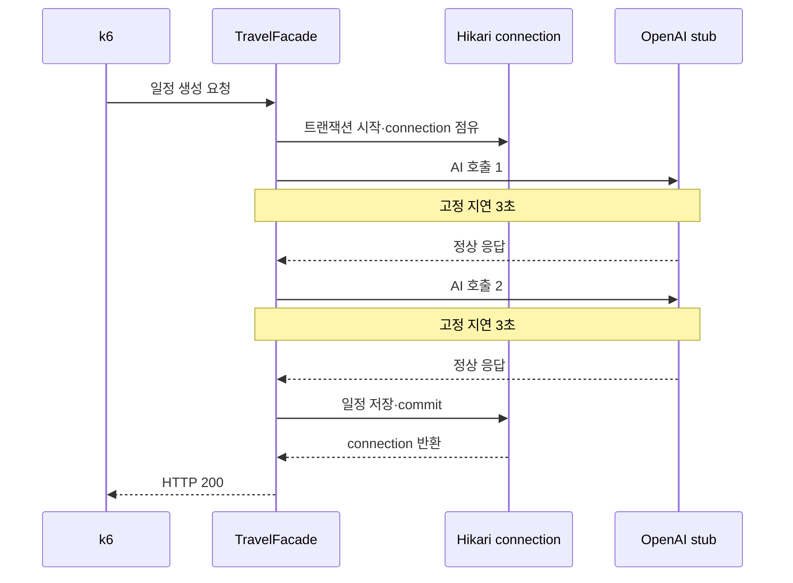

# Phase 4A-2 Travel AI 자원 포화 실험 결과

## 1. 실험 개요

외부 API의 응답시간 자체가 아니라, 느린 외부 호출을 기다리는 동안 백엔드가
DB connection과 Tomcat 요청 스레드를 어떻게 점유하는지 확인함.

실제 OpenAI 호출은 사용하지 않음. OpenAI 정상 응답을 호출당 3초로 고정하고,
Kor2·Kakao·영양 API는 정상 응답하는 로컬 스텁으로 대체함. 이를 통해 외부 장애와
AI 출력 변동을 제거하고 현재 일정 생성 아키텍처의 자원 점유만 관찰함.

| 항목 | 값 |
|---|---|
| testid | `phase4a2-low-20260930-165254` |
| 측정 시간 | 2026-09-30 16:53:03~16:54:40 KST |
| 요청 모델 | k6 `constant-arrival-rate` |
| 목표 요청률 | 1 req/s |
| 부하 시간 | 60초 |
| OpenAI 고정 지연 | 호출당 3초 |
| 일정당 OpenAI 호출 | 2회 |
| 데이터베이스 pool | Hikari 최대 10 |

저율 기준선 뒤에는 같은 환경에서 3 req/s·60초 DB pool 탐색을 실행함.

| 항목 | 저율 기준선 | DB pool 탐색 |
|---|---:|---:|
| testid | `phase4a2-low-20260930-165254` | `phase4a2-pool-20260930-215019` |
| 목표 요청률 | 1 req/s | 3 req/s |
| Hikari 최대 connection | 10 | 10 |
| 최대 VU 설정 | 20 | 60 |

## 2. 포트폴리오 핵심 요약

> 1 req/s에서는 Hikari active가 최대 6이고 pending은 0이었음. 3 req/s에서는
> active가 10/10에 도달하고 pending이 최대 47, 약 84초 연속 발생함. 같은 구간의
> Tomcat busy는 57/200(28.5%), process CPU는 최대 6.7%였음. 따라서 이 조건의
> 선행 제약은 Tomcat이나 CPU가 아니라 Hikari connection pool이며, AI 호출을 포함한
> 긴 트랜잭션 경계가 pool 포화를 만드는 가설을 확인함.



이 그림은 코드의 트랜잭션 범위와 이번 계측 결과를 함께 표현함. connection을
6.663초 점유했다는 값만으로 모든 요청에서 같은 실행 순서를 인과적으로 증명한 것은
아님. 다만 3 req/s에서 active 10/10과 pending의 지속 증가가 함께 관측되어,
트랜잭션 안의 외부 호출이 connection pool을 선행 포화시키는 가설을 확인함.

## 3. 측정 결과

| 지표 | 결과 |
|---|---:|
| 완료 iteration | 61건 |
| 평균 완료량 | 약 1.02건/초 |
| 일정 생성 성공률 | 100% |
| 응답 및 일정 구조 check | 모두 100% |
| HTTP 5xx·timeout | 0건 |
| dropped iteration | 0건 |
| 응답시간 p50 | 6.109초 |
| 응답시간 p95 | 6.593초 |
| 응답시간 p99 | 6.660초 |
| 최대 응답시간 | 6.677초 |
| 최대 VU | 6 |
| Hikari active 최대 | 6 / 10 |
| Hikari pending 최대 | 0 |
| Hikari connection 최대 점유시간 | 6.663초 |
| Tomcat busy 최대 | 7 / 200 |
| Tomcat current 최대 | 10 |
| Tomcat busy 비율 최대 | 3.5% |
| process CPU 최대 | 13.5% |
| system CPU 최대 | 32.5% |

실험 종료 시 Hikari active·pending과 HTTP active request가 모두 0으로 복귀함.

## 4. 저율 기준선 해석

OpenAI 고정 지연 6초가 포함된 일정 생성의 p50은 6.109초였음. 부가적인 Tool 호출,
검증, 경로 계산과 DB 저장을 포함해도 응답시간 분산은 작았으며 모든 요청이 정상
완료됨. 따라서 저율 조건을 고율 실험의 기준선으로 사용함.

1 req/s에서 최대 VU와 Hikari active가 모두 6이었음. 이는 `요청률 1 req/s × 약 6초`
로 계산한 예상 동시 요청 수와 일치함. Hikari connection 최대 점유시간 6.663초도
최대 응답시간 6.677초와 거의 같았음.

이 결과는 현재 트랜잭션이 외부 AI 응답을 기다리는 동안 DB connection을 요청 전체
시간에 가깝게 점유한다는 가설을 강하게 지지함. 다만 1 req/s에서는 active가 6으로
pool 최대 10보다 낮고 pending도 0이어서 실제 포화는 발생하지 않음.

Tomcat busy 비율은 최대 3.5%, process CPU는 최대 13.5%였음. 따라서 저율 조건에서
Tomcat worker thread와 CPU는 선행 병목이 아님.

핵심 수치의 관계는 다음과 같음.

| 비교 | 계산 | 의미 |
|---|---:|---|
| 예상 동시 요청 | `1 req/s × 6.109초 ≈ 6.1` | 실제 최대 VU 6과 일치 |
| 요청 대비 connection 점유 | `6.663 / 6.677 ≈ 99.8%` | 요청 생명주기 대부분에 걸쳐 connection을 점유했을 가능성 |
| DB pool 여유 | `6 / 10` | 저율 조건에서는 pool 포화 없음 |
| Tomcat 사용률 | `7 / 200 = 3.5%` | 요청 스레드는 저율 조건의 선행 병목이 아님 |

## 5. 저율 기준선 판정

| 가설 | 판정 | 근거 |
|---|---|---|
| 고정된 AI 지연의 안정적 재현 | 확인 | p50 6.109초, p99 6.660초 |
| 외부 호출 대기 중 DB connection 장기 점유 | 강한 정황 | Hikari usage 최대 6.663초가 요청 최대 6.677초와 유사 |
| 1 req/s에서 Hikari 포화 | 기각 | active 최대 6, pending 0 |
| 1 req/s에서 Tomcat 포화 | 기각 | busy 최대 7/200, 3.5% |
| 1 req/s에서 CPU 포화 | 기각 | process CPU 최대 13.5% |

## 6. 3 req/s DB pool 탐색 결과

| 지표 | 1 req/s | 3 req/s | 변화 |
|---|---:|---:|---:|
| 예정 iteration | 약 60건 | 180건 | 3배 |
| 완료 iteration | 61건 | 140건 | 목표의 77.8% 완료 |
| dropped iteration | 0건 | 33건 | 목표의 18.3% |
| interrupted iteration | 0건 | 7건 | 목표의 3.9% |
| 완료 요청 성공률 | 100% | 100% | 동일 |
| 응답시간 p50 | 6.109초 | 20.578초 | 약 3.37배 |
| 응답시간 p95 | 6.593초 | 31.486초 | 약 4.78배 |
| 응답시간 p99 | 6.660초 | 32.783초 | 약 4.92배 |
| 최대 응답시간 | 6.677초 | 33.378초 | 약 5.00배 |
| 최대 VU | 6 | 57 | 약 9.5배 |
| Hikari active 최대 | 6 / 10 | 10 / 10 | pool 상한 도달 |
| Hikari pending 최대 | 0 | 47 | 대기열 발생 |
| Hikari pending 연속 구간 | 0초 | 약 84초 | 판정 기준 10초 초과 |
| Hikari connection 최대 점유시간 | 6.663초 | 6.685초 | 거의 동일 |
| Tomcat busy 최대 | 7 / 200 | 57 / 200 | 3.5% → 28.5% |
| process CPU 최대 | 13.5% | 6.7% | 포화 없음 |
| system CPU 최대 | 32.5% | 45.1% | 포화 없음 |

완료된 140건의 HTTP 응답과 일정 구조 검사는 모두 성공했고 5xx는 없었음. 다만
성공률의 분모에는 33건의 drop과 7건의 interrupt가 포함되지 않으므로, 이를 3 req/s
처리 성공으로 해석하지 않음. 실행 종료 후 Hikari active·pending과 HTTP active
request는 모두 0으로 복귀함.

### 6.1 대기시간이 증가했다

Hikari connection 최대 점유시간은 저율 6.663초, 고율 6.685초로 거의 같았음.
반면 전체 응답 p95는 6.593초에서 31.486초로 증가함. 고율 실행에서 늘어난 시간은
외부 호출시간이 아니라 connection을 얻기 전 대기시간으로 해석 가능함.

### 6.2 pool의 조건부 처리량과 일치한다

```text
10 connections / 6.68 seconds ≈ 1.50 requests/second
```

실제 실행은 약 90.4초 동안 140건을 완료해 약 1.55 req/s를 기록함. 3 req/s로
유입했지만 완료율이 이를 따라가지 못했고 VU와 pending이 계속 증가함.

### 6.3 DB pool이 먼저 포화됐다

Hikari active는 10/10, pending은 최대 47이며 약 84초 이어짐. 같은 시간 Tomcat
busy는 최대 57/200으로 28.5%, process CPU는 최대 6.7%였음. 사전에 정한 판정
기준에 따라 Hikari connection pool을 선행 병목으로 확정함.

30 req/s Tomcat 탐색은 실행하지 않음. 3 req/s에서 Hikari pending이 지속되면
다음 부하 단계로 넘어가지 않기로 실험 전에 결정함. 다음 리팩토링에서는
pool 크기 증가나 가상 스레드 적용보다 AI 호출을 포함한 트랜잭션 경계를 먼저 줄이고,
같은 조건으로 전후 결과를 비교할 예정임.

## 7. 포트폴리오 서술 초안

> 외부 AI API의 응답시간은 백엔드에서 직접 단축할 수 없지만, 응답을 기다리는 동안
> 내부 자원을 점유하는 방식은 아키텍처로 통제 가능함. 실제 API 변동과 장애를
> 제거하기 위해 OpenAI 정상 응답을 호출당 3초로 고정한 로컬 스텁과 k6 open-model
> 부하 환경을 구성함. 1 req/s에서는 61건이 모두 성공하고 p95가 6.59초였지만,
> 3 req/s에서는 Hikari connection 10개가 모두 사용되고 pending이 최대 47까지
> 증가함. connection 점유시간은 약 6.68초로 그대로였는데 전체 p95는
> 31.49초로 4.78배 증가했고, Tomcat 사용률은 28.5%, process CPU는 6.7%에
> 그침. 이를 통해 외부 호출 자체가 아니라 AI 호출을 포함한 긴 트랜잭션이
> DB connection 대기열을 만든다는 병목을 분리해 확인했고, 트랜잭션 경계 축소를
> 다음 개선 우선순위로 결정함.

## 8. 포트폴리오 시각 자료 배치

캡처는 다음 네 장을 본문에 사용하고, 나머지는 부록으로 분류함.

| 그림 | 사용할 캡처 | 캡션 |
|---|---|---|
| 1 | 1 req/s 전체 Grafana 화면과 `testid` | 외부 변동을 제거한 통제 실험과 정상 기준선 |
| 2 | 1 req/s·3 req/s 응답시간 패널 | p95 6.59초 → 31.49초, 약 4.78배 증가 |
| 3 | 3 req/s Hikari active·pending·usage | active 10/10, pending 최대 47, connection 점유시간 약 6.68초 유지 |
| 4 | 3 req/s Tomcat·CPU | Tomcat 28.5%, process CPU 6.7%로 선행 병목에서 제외 |

본문에서는 그림 2와 3을 나란히 배치해 `connection 점유시간 유지 → pending 증가 →
전체 응답시간 증가`를 한눈에 비교함. 전체 대시보드 캡처는 testid와 시간 범위가
보이도록 원본을 보존하고, 본문에는 해당 패널만 잘라낸 이미지를 사용함.

### 발표용 한 문장

> 외부 AI가 느리다는 현상을 그대로 받아들이지 않고 변동을 통제한 부하 실험으로
> 분해해, 3 req/s에서 Hikari pool이 Tomcat과 CPU보다 먼저 포화되는 것을 확인함.

### 이 결과로 말할 수 없는 것

- 실제 OpenAI와 외부 API의 품질 또는 장애율
- 운영 환경의 최대 처리량
- 트랜잭션 경계 수정 전후의 개선 폭
- 다중 사용자·다중 인스턴스 환경의 처리량

위 항목은 이후 동일 조건의 전후 비교가 끝난 뒤 추가할 예정임.

## 9. 전체 시각 자료 후보

1. 일정 생성 요청과 Hikari·OpenAI 스텁·Prometheus의 데이터 흐름
2. Grafana 전체 대시보드와 `testid`
3. 응답시간 p50·p95·p99 패널
4. Hikari active·pending과 usage time 패널
5. Tomcat busy/max와 CPU 패널
6. `p95 6.59초 → 31.49초`와 `pending 0 → 47` 강조 비교

이 결과는 로컬 스텁과 단일 사용자로 수행한 아키텍처 진단 기준선임. 실제 외부 API
품질, 운영 인프라 최대 처리량 또는 개선 후 성능을 의미하지 않음.
